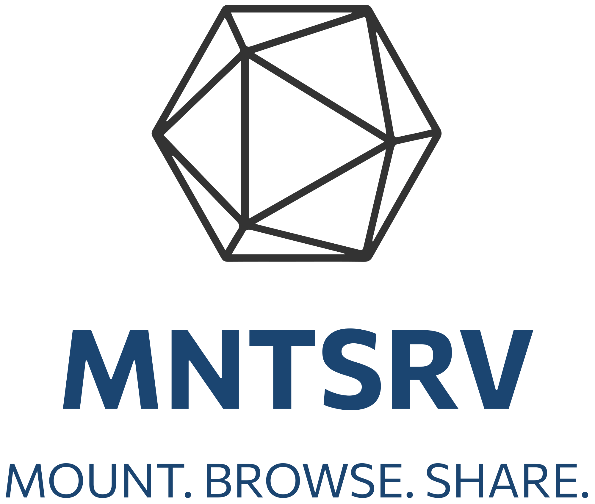

# mntsrv



> **Disclaimer:**  
> Almost the entire project's codebase was generated by AI.  
> All advanced prompting, design direction, and critical task engineering required to achieve solid outputs for this project were authored by [Christian Romeni](https://github.com/christianromeni).

mntsrv is a web-based file sharing and management platform. It allows users to browse directories, search for files, and securely share files or folders with others through a modern web interface.

## Overview

mntsrv consists of a Python backend and a React frontend. The backend handles directory scanning, file search, user authentication, and sharing logic, while the frontend provides an intuitive interface for browsing, searching, and managing shared files.

## Features

- Browse and navigate server-side directories from the web UI
- Search for files and folders with instant results
- Share files or folders with others using secure links
- Track sharing activity and manage access
- User authentication and access control

## Directory Structure

- `backend/` – Python backend for directory scanning, search, sharing, and API endpoints
- `frontend/` – React frontend for the user interface

## Getting Started

1. **Install dependencies**  
   - Backend:  
     ```
     cd backend
     pip install -r requirements.txt
     ```
   - Frontend:  
     ```
     cd frontend
     npm install
     ```

2. **Configure environment**  
   - Copy `backend/.env.example` to `.env` and adjust settings as needed.

3. **Run the application**  
   - Start the backend server:  
     ```
     python main.py
     ```
   - Start the frontend development server:  
     ```
     npm start
     ```

4. **Access the app**  
   - Open your browser and go to `http://localhost:3000`

## License

This project is licensed under the MIT License.
